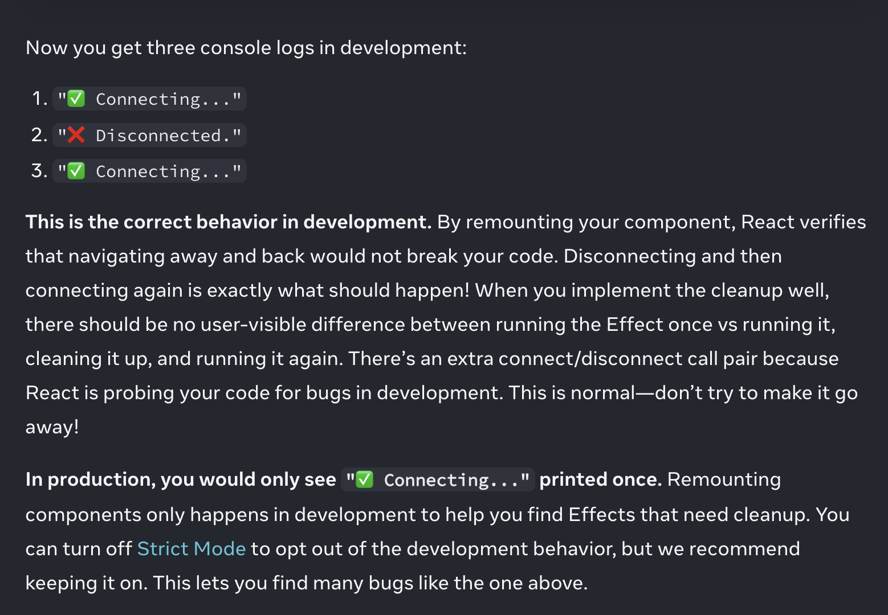

# Project structure
- `layout.tsx`: es el archivo como "root" que tiene todo el layout de la aplicación. es como que aquí iría el navbar arriba y el navbar al lado, por ejemplo
- `page.tsx`: eso ya sería una página un poco más local (home, pedidos, etc. calendario)
- `components` folder: acá van a ir a parar los reusable components tipo React. El primero que aparece es `button.tsx` (dentro del folder ui) que fue descargado a través de la librería shadcn-ui
  - Notar que al importarlo en `page.tsx` lo imporé directamente como "componente", no hice un import del archivo .tsx
## Routing
- Todo lo que está dentro del app folder puede ser potencialmente una página web servida en el cliente (un /leonel/)
  - Para evitar lo anterior con cierta carpeta, se le puede poner un "_" al principio y así el compilador sabrá que NO tiene que ser servida (entregará un 404 al buscar la ruta en el browser)
  - Route groups: eso es la wea de la carpeta `(root)` que no entendí, que también afectó un archivo `page.ts` con los imports, dentro de la carpeta `.next` en el root del proyecto
    - Así puedo hacer layouts por grupo
    - La carpeta marcada con () NO afecta el URL, es solo para organizar. No es parte de la URL hasta que se llega a un folder sin () y que es un path
  - Rutas variables: `[documentId]`

## Shadcn-ui
- Es un "materialUI": una libería de componentes UX/UI ya hechos y que están on top de Tailwind (además de poner sus propias clases, como `text-muted-foreground`).
- Para importar distintos componentes, siempre se hace algo tipo `npx shadcn-ui@latest add componentName`.
- Algo que me pareció demasiado interesante - asumiendo que uno se sube al tren de NextJS - es que los componentes importados se "copian y pegan" localmente.
  - Esto también pasa en Python - cuándo uno pip installea una librería - pero la diferencia es que en Python esto en general es más opaco porque queda en los directorios del venv y la wea
  - En el caso de Next, la wea queda ahí carepalo, en una carpeta UI. Es como que importas el source code "copiado", entonces te reduce la fricción a editarlo y, __a diferencia de Python__, estás incentivado a editarlo tú mismo, localmente.
  - Para un ejemplo de lo anterior, [Caca](https://youtu.be/0OaDyjB9Ib8?si=hCjelisj2Zv42uw5&t=8936)

## Lucide-react
- Es una carpeta de íconos, botoncitos, chevrones, etc. -> componentes UI. Es tipo "favicon" y cosas así

# What am I doing
## Button
- El botón tiene unos parámetros que uno puede invocar como atributos del botón y que vienen predefinidos: esto son los `variants` del botón. Son dos agumentos: `variant` y `size` por ejemplo. Es decir, yo le paso `variant = caca, size = popo` y gano el juego. El keyword `variants` (para declarar este tipo de argumentoss) pareciera estar reservado e importado desde una librería.
  - las línea que lo exportan son el *otro* export de ese archivo: `ButtonProps`. Así es como TypeScript después sabe cuáles son las posibles `variant` y `size`, lo interpreta, te marca un error si no calza, etc.
- Además viene con algunas clases de CSS que NO pueden ser modificadas desde fuera, solo editando el source code directamente

# Syntax
## Conventions
- snakeCase for variables in JSX `let thumbnailSize = 's';`

## CSS
- Pseudo-classes: es toda la wea de "algo:hov", "algo:hidden", todas esas weas. [Acá la biblia](https://drafts.csswg.org/selectors/#pseudo-class)
- Hay un truco para poder poner comportamientos a varias cosas al mismo tiempo sin clases de css, que se llama "grouping". Buscar esto en el repo y en el video sería 1:52: group/sidebar
- class vs className (inlining css): En .tsx y .jsx, la palabra `class` está reservada y simplemente por eso no se puede usar => hay que asignar clases con `className` (del mismo modo que uno lo haría con class en HTML normal)

### Box-model
- default: box-border => el tamaño del elemento que yo especifico __incluye__ content, border, padding. I.e. `widthISpecify = contentWidth + borderSizeRight + borderSizeLeft + paddingSizeRight + paddingSizeLeft`.
  - Por favor notar que NO SE INCLUYE EL MARGIN. El margin siempre es adicional (and remember that margins collapse max(margin_i, margin_(i+1)))

## JS

- It is useful to remember which operations on arrays mutate them, and which don’t. For example, push, pop, reverse, and sort will mutate the original array, but slice, filter, and map will create a new one.

- Use let and const, never var
- Spread syntax:
  
- 
- Immer (`npm install use-immer`) lets you update state "normally", like it would have been done through local mutation


## TSX
```
{
  children } : {
    children: React.ReactNode;
  }
```
notation in argument declaration is [Parameter destructuring](https://www.typescriptlang.org/docs/handbook/2/functions.html#parameter-destructuring)

- When declaring interfaces, types, props, etc.: if you do `"id?: number"` (for example) that means that id is an optional param / arg
- !!variable = transformámelo en booleano (especialmente útil para ternary checks). esto es por si algo es valor o undefined


## React and react-like syntax

### useState Logic

**En el fondo, setState gatilla un re-render con el nuevo valor pero no cambia el valor del estado si se usa "así no más"**
- Para updatear el estado, hay que hacer una función que tome literalmente el estado y lo updatee (además de gatillar el re-rendering)
  - Esto está hiper bien explicado en este [loom](https://www.loom.com/share/7aa172f152924ad89bfa9a79fd0a89a5?sid=c7e45ddb-dfa0-49b6-94a2-95fd502b0a73)
- All events propagate in React except onScroll, which only works on the JSX tag you attach it to.
- e.stopPropagation() stops the event handlers attached to the tags above from firing.
- e.preventDefault() prevents the default browser behavior for the few events that have it.
- Local variables don’t persist between renders. When React renders this component a second time, it renders it from scratch—it doesn’t consider any changes to the local variables.
- A state variable’s value never changes within a render, even if its event handler’s code is asynchronous. Inside that render’s onClick, the value of number continues to be 0 even after setNumber(number + 5) was called. Its value was “fixed” when React “took the snapshot” of the UI by calling your component.
- Changes to local variables won’t trigger renders. React doesn’t realize it needs to render the component again with the new data.
- Como `setState` updatea el estado AND **triggers a re-rendering**, eso implica que se vuelve a llamar la función en JSX (se vuelve a "ejecutar el componente de React" -> re-render). Por lo tanto, todo el código corre de nuevo **inclusive** el `useState` de lo más arriba. Pero como usaste `useState`, el framework React sabe que la variable estado si persiste y por eso sí renderea con el estado correcto (no vuelve a correr `useState(default)`)
- React waits until all code in the event handlers has run before processing your state updates. This is why the re-render only happens after all these setNumber() calls. This might remind you of a waiter taking an order at the restaurant. A waiter doesn’t run to the kitchen at the mention of your first dish! Instead, they let you finish your order, let you make changes to it, and even take orders from other people at the table.
  - This lets you update multiple state variables—even from multiple components—without triggering too many re-renders. But this also means that the UI won’t be updated until after your event handler, and any code in it, completes. This behavior, also known as batching, makes your React app run much faster. It also avoids dealing with confusing “half-finished” renders where only some of the variables have been updated.
- "But sometimes you might want to perform multiple operations on the value before queueing the next render." -> It is an uncommon use case, but if you would like to update the same state variable multiple times before the next render, instead of passing the next state value like setNumber(number + 1), you can pass a function that calculates the next state based on the previous one in the queue, like setNumber(n => n + 1). It is a way to tell React to “do something with the state value” instead of just replacing it.
  - The entire queue is processed before final re-rendering. setState puts "re-render with new state" in the queue, but the re-render will occur ONLY after the entire queue is finished. So if the queue es "re-render with new state" + "set State to leonel" -> the final re-render with be with state Leonel
  - During the re-render, React will process the queue.
- In other words, you should treat any JavaScript object that you put into state as read-only.
  - Acá se refiere a que el state también pueden ser objetos (strings, booleans y numeros no son objetos) y que los objetos en teoría si se pueden mutar tipo `objetio.propiedad = leonel` => **NO HACER ESO**. Para cambiar el estado, usar `set` del estado.

### useEffect Logic
[Página de React](https://react.dev/learn/synchronizing-with-effects) 
- Los efectos son como "salirse de React" para conversar con otras cosas que la página web puede interactuar: otras API, `window`, etc.
- Recordar que un cambio de estado siempre gatilla un re-render del componente. También, que ante EVENTOS y el event handler (`onClick`, `onSubmit`, etc.) uno puede querer gatillar el re-render de algo y alterar en ello el UI también.
- ¿Qué pasa cuándo quiero que algo suceda independiente de un evento? Los ejemplos que da el curso de React son estar conectado (o conectarse) a un server o al chat.
  - El ejemplo en Jotion era que, al achicar el browser para irse a Mobile, desapareciera el sidebar.
- Con `useEffect` puedo hacer cosas ante cada re-render. Eso significa que __cada vez__ que haya un re-render del componente (i.e. algún cambio de estado) se gatillará una acción.
  - Esto es lo que el Chalo abusó con todo en el portal de pacientes, porque está gatillando miles de useEffects que no deberían serlo
- Se puede hacer que no haya con CADA re-render, si no con algunos en particular. Recordar que React 1) triggerea un re-render (cambio de estado) 2) renderea el componente 3) __commitea__ en el DOM el componente nuevo. Después de este paso, se gatillan todos los `useEffects`. In other words, `useEffect` delays a piece of code from running until that render is reflected on the screen.
- In React, rendering should be a pure calculation of JSX and should not contain side effects like modifying the DOM.
- Es POR LO ANTERIOR que uno tiene que "escapar" de React con `useEffect`. Mientras se está calculando el re-rendering (que debe ser una pure calculation, sin side effects en el DOM) no se puede tocar el DOM. Por lo tanto, `useEffect` patea la acción hasta después del trigger -> render -> commit
- In this example, the “external system” you synchronized to React state was the browser media API. You can use a similar approach to wrap legacy non-React code (like jQuery plugins) into declarative React components.
- ¿Cómo evito que se gatille el efecto después de CADA re-rendering? Le puedo pasar un segundo argumento al llamado de `useEffect`: un arreglo con las dependencias que quiero "sensar si cambian" y ahí sí usar el efecto.
- The dependency array tells React that it should skip re-running your Effect if isPlaying is the same as it was during the previous render.

- Mounting: SUCEDE 2 VECES EN DEVELOPMENT!!!!!! EN PRODUCCIÓN SUCEDE UNA VEZ.
- Cleanup: connect, disconnect, subscribe, unsubscribe

- Mounting: SUCEDE 2 VECES EN DEVELOPMENT!!!!!! EN PRODUCCIÓN SUCEDE UNA VEZ.
- You can think of useEffect as “attaching” a piece of behavior to the render output. 
- You can’t declare an Effect conditionally, but your Effect can include conditional logic.
- If an Effect fetches something asynchronously, it usually needs cleanup. Bugs like this are called race conditions because two asynchronous operations are “racing” with each other, and they might arrive in an unexpected order.
### Syntax quirks
```
const caca = () => {
  return (  );
}
```
- Esa wea es equivalente a declarar una constante caca = FUNCIÓN que hace lo que está dentro del {} al otro lado de la flecha. It's called "fat arrow"
- Esta wea es útil por el this y weas complicadas de Javascript.
- Importantísimo el uso de las arrow functions y entenderlo: [click acá](https://developer.mozilla.org/en-US/docs/Web/JavaScript/Reference/Functions/Arrow_functions)
  - En particular `() => ()` es una arrow function que devuelve un objeto (esta se usa harto en `map`). Ojo acá con usar `() => {}` pues aquí se espera una __función__ (con su `return` statement)
- JSX requires tags to be explicitly closed: self-closing tags like &lt;img> must become &lt;img />, and wrapping tags like &lt;li>oranges must be written as &lt;li>oranges&lt;/li>.
- Comentar en JSX = {// } o {/* */} => Básicamente, abre una ventana a javascript y comenta.

### No children => self-closing tag
- [In JSX, tags that don't have children should be self-closed, just like in XML](https://codedamn.com/news/reactjs/not-closing-jsx-tags-properly#common_mistakes_when_closing_jsx_tags)

- [Some developers make the mistake of closing custom components using the same syntax as HTML elements, which leads to errors.](https://codedamn.com/news/reactjs/not-closing-jsx-tags-properly#4_incorrectly_closing_custom_components)

## Pitfalls


## Components
- _components folders are for not reusable components
- reusable components go into the components folder

### Server side components
- __Puedo hacer componentes async__. Page is an async component. This allows you to use await to fetch data (del curso de Next Js)
- Los console.log que haga acá (esto es un brain-fuck porque JS es "front" y Python es back) __salen en el terminal__, no en la consola.
### Client side componentes
- Directiva `"use client;"` al principio. Esto es necesario para poder usar React "puro": useState, useEffects, etc. etc. Si tratas de usar React puro y no se puede, va a llorar.
- Son rendereados en el cliente. En general, se incrustan a server side components. La heurísitca es: ¿es súper responsivo mi componente? Si sí, probablemente client side.
- Los console.log que haga acá salen en la consola, como siempre.

### Insights
- En React, todo son funciones al final. Los componenetes pareciera que son funciones

# Back-end

## Next Back-end
- Los capítulos 6 a 9 del curso de Learn next son clave.
- Hay cosas bien interesantes de performance. En particular, como hacer carga correcta de componentes (static, dynamic, streaming). [Con streaming + skeletons](https://nextjs.org/learn/dashboard-app/streaming), se pueden hacer los UI exquisitos!
  - Esto es __independiente__ de qué back-end se use para fetchear la data. O sea, lo voy a tener que probar, pero igual.
- Algo bien importante es como propone Vercel hacerse cargo de las búsquedas y todo eso (capítulo 10). En el fondo, ellos prefieren y empujan hacerlo en el front.
- También muy importante es el capítulo de mutar la data [(CRUD)](https://nextjs.org/learn/dashboard-app/mutating-data)

## Convex
- Es una plataforma agilada para hacer weas de la puta y, en particular, me va a gestionar el back-end
- Voy a tener que tener los dos terminales corriendo: el `npm run dev` y el `npx convex dev`
- En el archivo env.local tengo la config de Convex (la public URL en particular)
- Se consstruye la API acá y se hostea web. Los cambios que hago en el schema, en los métodos etc. aparecen en la web.
- Hostea la API. La carpeta `convex` tiene las "rutas" de la API y convex se encarga del back-end con sus propios métodos especiales => habría que aprenderse la documentación

## Clerk
- Zero to login in 10 minutos (increíble esta wea). Resolvieron el problema de loging management. 

# Trunk
- Ta fino, lo disablié (workspace) en el repo de encuadrado y en este también

# Misc
- Creo que usa `page.tsx` como en Encuadrado usamos `index.html`, index en general
- Every layout component has children

## VS Code
- Me bajé la extensión de las fast arrows
- En el 3:20:00 más o menos Antonio explica como poner format automático al guardar

# Flask - Next / React
## Rewrites
- Con rewrites pude rutear - condicionalmente - llamados al back-end en Flask. El server en :5000 tiene que estar encendido por supuesto.
- No es difícil, works "out of the box" la verdad. Tengo un tab en Tabox con la literatura mínima para hacerlo.
- __Importante__: La prueba que hice me muestra lo que está pasando en localhost: localhost:3000/flask_backend/test-que-quiera. Es decir, hubo una especie de "redirección" del puerto (notar el 3000, no 5000)

## GET y POST, llamados duplicados
- Ni POST, PATCH, PUT, DELETE se llaman 2 veces.
- Me da la sensación de que los GET __no hay forma__ que no se llamen 2 veces, incluso en producción. Esto NO es por ReactStrictMode (ya probé desactivándolo y para navegación en Next __sí se deja de llamar 2 veces__ pero para Flask-GET sigue llamándose 2 veces) si no por el tema de rewrites en sí y automatic static optimization.
  - Por lo tanto, este comportamiento intuyo que también va a psar en producción y, si es así, entonces __no se puede usar rewrites para ir a Flask__. NO OBSTANTE: si se puede rutear a Flask directo (tal como lo hago en development con localhost:500, CREO). Seguro puedo configurar para que en el server se escuchen los puertos 3000 y 5000 independientemente y con rewrites mandar de un 3000 a Flask (pero ahí no hacer el GET)